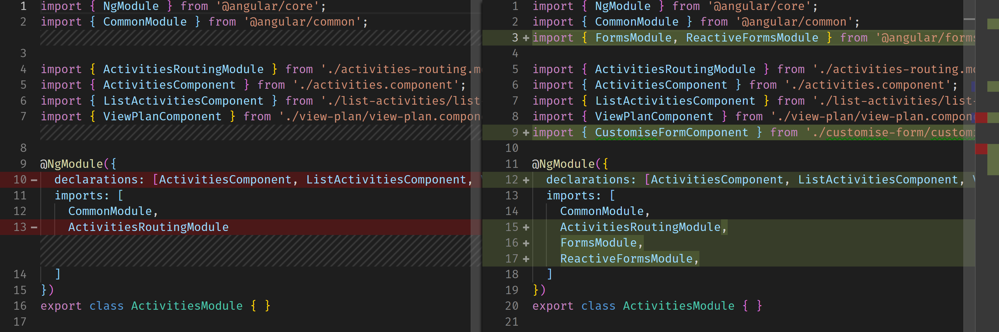
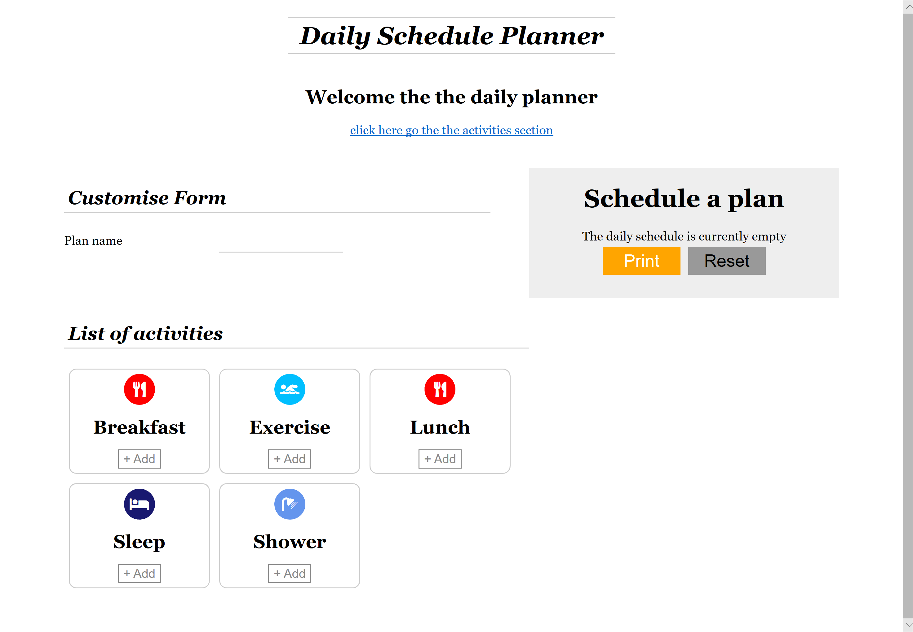

# Angular Reactive Forms

[Live code](https://stackblitz.com/edit/s6b-reset-plan-update-activities-list) to follow along from this section.

> Reactive forms provide a model-driven approach to handling form inputs whose values change over time. [https://angular.io/guide/reactive-forms](https://angular.io/guide/reactive-forms)
>
> They are built on observable base API \(async data flow\) to read continuous stream of values inputted to the form. It enables more customisation on complex forms or ones with dynamically created inputs at run time and is also better with unit testing.


Angular also offer Template Driven forms as an alternative but is is excepted best practice to use Reactive Forms.


Create a new customise-form component

```bash
ng g c activities/customise-form
```

Import FormModules and ReactiveFormsModule into the activities.modules.ts file

**...\daily-planner\src\app\activities\activities.module.ts**

```typescript
import { FormsModule, ReactiveFormsModule } from '@angular/forms';

imports: [
    CommonModule,
    ActivitiesRoutingModule,
    FormsModule,
    ReactiveFormsModule,
  ]
```

 Diff for activities.module.ts.

**...\daily-planner\src\app\activities\customise-form\customise-form.component.ts**

In the customise-form.component.ts page, add a modelForm variable with the type formGroup. Then inject formBuilder - making sure to import it from the @angular/forms node-module

Finally, in the customise-form.component.ts file, set the formGroup with the formControlName as per below

```typescript
import { Component, OnInit } from '@angular/core';
import { FormGroup, FormBuilder } from '@angular/forms';

@Component({
  selector: 'app-customise-form',
  templateUrl: './customise-form.component.html',
  styleUrls: ['./customise-form.component.css']
})
export class CustomiseFormComponent implements OnInit {
  modelForm: FormGroup;

  constructor(private fb: FormBuilder) {
    this.modelForm = this.fb.group({
      name: ''
    });
  }

  ngOnInit() {
  }

}
```

Add the code to the customise-form.component.html file

**...\daily-planner\src\app\activities\customise-form\customise-form.component.html**

```markup
<section id="customise">
  <h1>Customise Form</h1>
  <form [formGroup]="modelForm">
    <p>
      <label>Plan name</label>
      <input type="text" formControlName="name">
    </p>
  </form>
</section>
```

Add the selector app-customise-form to activities.component.html

**...\daily-planner\src\app\activities\activities.component.html**

```markup
<app-view-plan (updateActivitiesList)="updateActivities($event)" (reloadActivities)="reload()"></app-view-plan>
<app-customise-form></app-customise-form>
<app-list-activities [activitiesList]="activities" (addItemPlan)="addToPlan($event)"></app-list-activities>
```



Completed [live code](https://stackblitz.com/edit/s7-reactive-forms) for this section.

