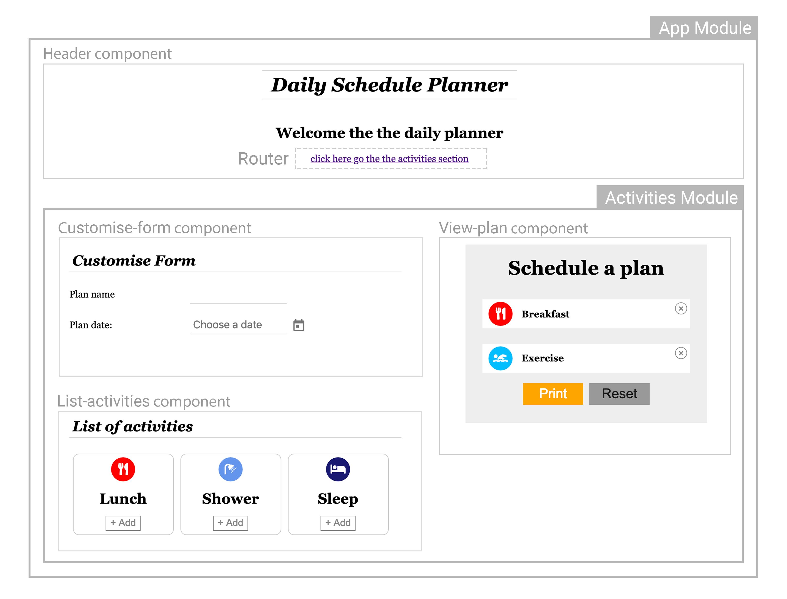
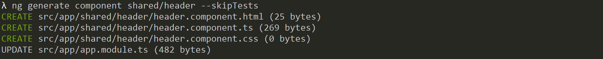
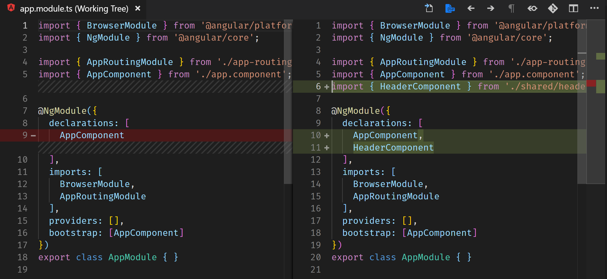

# Components and Modules

[Live code](https://stackblitz.com/edit/setup) to follow along from this section.

> Angular apps are modular and Angular has its own modularity system called NgModules. NgModules are containers for a cohesive block of code dedicated to an application domain, a workflow, or a closely related set of capabilities. They can contain components, service providers, and other code files whose scope is defined by the containing NgModule. [https://angular.io/guide/architecture-modules](https://angular.io/guide/architecture-modules)


One of the best attributes of Angular is the ability to keep your code component-based and modularised. There is also a separation between the template HTML and the Typescript logic which we will demonstrate in this section. The act of keeping everything separate makes Angular scalable to big enterprise applications.


## UI Breakdown



Let's start by creating a component called **header.component.ts** with the single responsibility of displaying the Title and a router link for this project.

Under the src/app folder create a new folder called **shared**. Inside the **shared** folder create a folder called **header**. In the **header** folder create three new files called **header.component.html**, **header.component.css** and **header.component.ts**. The ts or typescript file holds the logic for the html and css file.

In the .ts file paste the following code

**../daily-planner/src/app/shared/header/header.component.ts**

```typescript
import { Component } from '@angular/core';

@Component({
  selector: 'app-header',
  templateUrl: './header.component.html',
  styleUrls: ['./header.component.css']
})
export class HeaderComponent {
}
```

In the html file paste the following

**../daily-planner/src/app/shared/header/header.component.html**

```markup
<header>
  <h1>Daily Schedule Planner</h1>
  <h2> Welcome the the daily planner</h2>
  <a routerLink="/activities">click here go the the activities section</a>
</header>
```


The css file here uses View Encapsulation to ensure the `<h1>`styles doesn't effect any other `<h1>` in our application. Without it, you will have to be very specific about which `<h1>` tag should be effected. In this case, only inside the header tag.


**../daily-planner/src/app/shared/header/header.component.css**

```css
header {
  margin-bottom: 40px;
}

h1 {
  display: inline-block;
  padding: 5px 15px;
  border-top: 1px solid #ccc;
  border-bottom: 1px solid #ccc;
  font-style: italic;
}
```

To use the header component created above, we need to declare it in **app.modules.ts** found in the **src/app** folder

**../daily-planner/src/app/app.module.ts**

```typescript
import { NgModule } from '@angular/core';
import { BrowserModule } from '@angular/platform-browser';

import { AppRoutingModule } from './app-routing.module';
import { HeaderComponent } from './shared/header/header.component';
import { AppComponent } from './app.component';

@NgModule({
  declarations: [
    AppComponent,
    HeaderComponent
  ],
  imports: [
    BrowserModule,
    AppRoutingModule
  ],
  providers: [],
  bootstrap: [AppComponent]
})
export class AppModule { }
```

Now replace the existing code generated from the **app.component.html** file with the following code.

**../daily-planner/src/app/app.component.html**

```markup
<app-header></app-header>
<router-outlet></router-outlet>
```

> A selector tells Angular to create and insert/render an instance of this component wherever it finds the corresponding tag in the template HTML. [https://angular.io/guide/architecture-components](https://angular.io/guide/architecture-components)


Congratulation! You have now created your first component in Angular


## Possible issue


If you come across any compilation errors associated with routing, you may have selected no when given the option of creating your project with routing and will need to create the below file manually.


**../daily-planner/src/app/app-routing.module.ts**

```typescript
import { NgModule } from '@angular/core';
import { Routes, RouterModule } from '@angular/router';

const routes: Routes = [];

@NgModule({
    imports: [RouterModule.forRoot(routes)],
    exports: [RouterModule]
})
export class AppRoutingModule { }
```

 **Figure: Result**

## AngularCLI generate command

Now that we know how to create a component manually, we can use an AngularCLI command that simplifies this process

```bash
ng generate component shared/header --skipTests
```

The following creates **header.component.css**, **header.component.css** and **header.component.css** in **app/shared/header** folder as well as modifies the **app.module.ts**.



Changes in **app.module.ts**



Completed [live code](https://stackblitz.com/edit/s1-components-modules) from this section.

