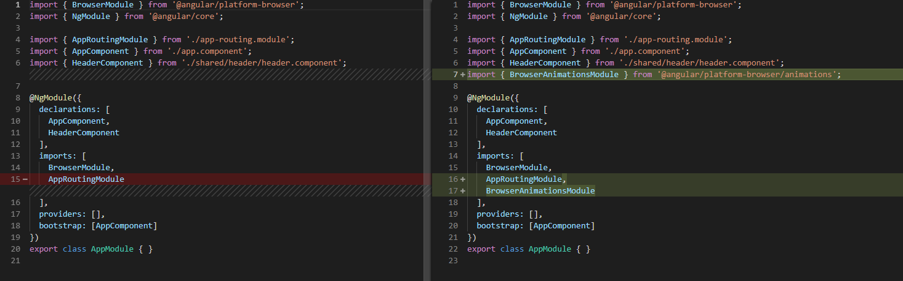
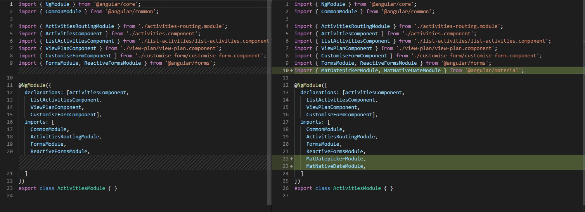
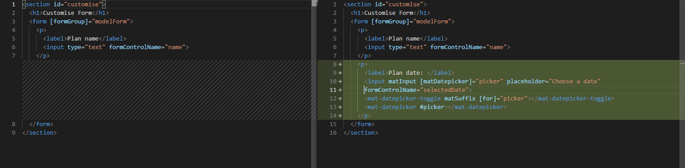

# Material Design Date Picker

[Live code](https://stackblitz.com/edit/s8-subscribe-unsubscribe-ondestroy) to follow along from this section.

> Angular Material is a component library based on Google's Material Design, and is built by the Google team to integrate seamlessly with Angular.

[https://material.angular.io/](https://material.angular.io/)

To use the Angular Material Components and the CDK tool kit \(for Drag and Drop\), we need to install angular/material and angular/cdk

```bash
npm install --save @angular/material @angular/cdk
```

These modules have some dependencies which need to be added to the app.module.ts

**...\daily-planner\src\app\app.module.ts**

```typescript
import { BrowserAnimationsModule } from '@angular/platform-browser/animations';

imports: [
    BrowserAnimationsModule
  ],
```

We can now uncomment out the line in the css file - this is a pre-built Angular Material theme that includes all of the styles for core Angular Material components

```css
@import '~@angular/material/prebuilt-themes/indigo-pink.css';
```

Import the MatDatepickerModule and the MatNativeDateModule in the activities.module.ts page

**...\daily-planner\src\app\activities\activities.modules.ts**

```typescript
import {
    MatDatepickerModule,
    MatNativeDateModule
} from '@angular/material';

@NgModule({
imports: [
    CommonModule,
    ActivitiesRoutingModule,
    FormsModule,
    ReactiveFormsModule,
    MatDatepickerModule,
    MatNativeDateModule,
]
```

Add more code to the customise-form.component.html page - under the closing &lt;/p&gt; tag so we can use the mat-datepicker

**..\daily-planner\src\app\activities\customise-form\customise-form.component.html**

```markup
<p>
   <label>Plan date: </label>
   <input matInput [matDatepicker]="picker" placeholder="Choose a date" formControlName="selectedDate">
   <mat-datepicker-toggle matSuffix [for]="picker"></mat-datepicker-toggle>
   <mat-datepicker #picker></mat-datepicker>
</p>
```

Add the selectedDate control to the modelForm in the customise-form.component.ts file

**..\daily-planner\src\app\activities\customise-form\customise-form.component.ts**

```typescript
constructor(private fb: FormBuilder) {
    this.modelForm = this.fb.group({
      name: '',
      selectedDate: ''
    });
  }
```

## Code Changed

Changes in **app.module.ts**



Changes in **activities.module.ts**



Changes in **customise-form.component.ts** 


Changes in **customise-form.component.html** 



Completed [live code](https://stackblitz.com/edit/s9-material-design-date-picker) for this section.

