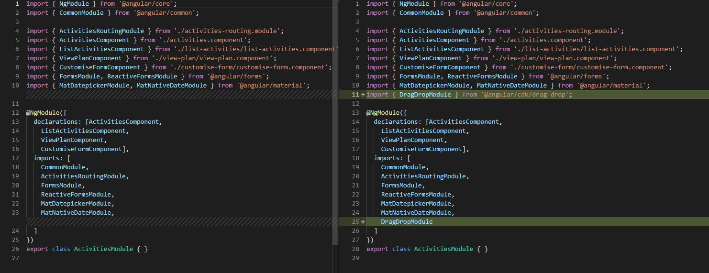
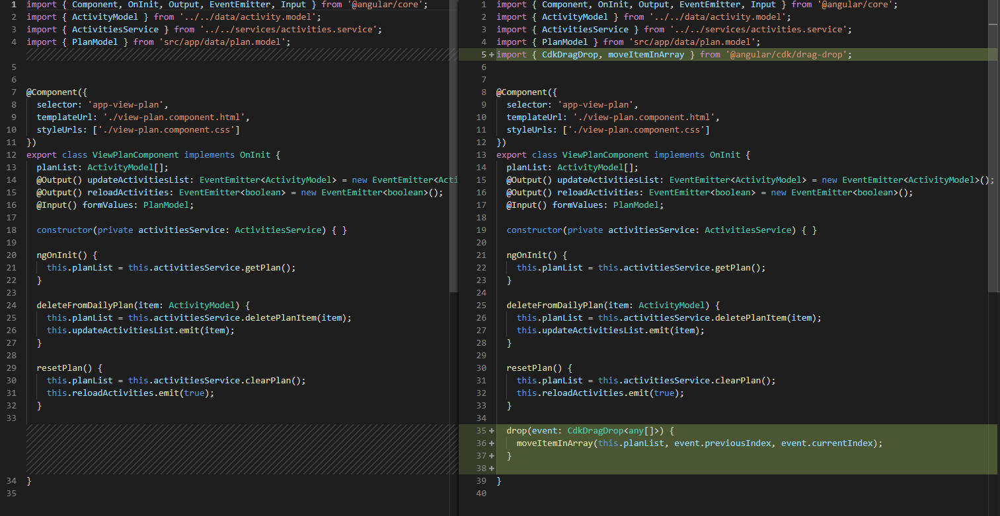
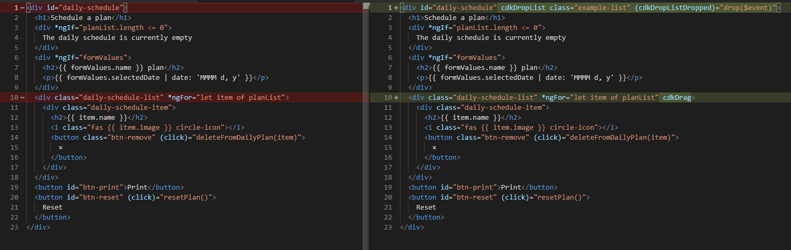

# Material Design Drag and Drop

[Live code](https://stackblitz.com/edit/s9-material-design-date-picker) to follow along from this section.

A standout in the recent release of Angular 7 was the Material Design drag and drop. Let's try it out.

Import the drag and drop module into the activities.module.ts:

**..\daily-planner\src\app\activities\activities.module.ts**

```typescript
import { DragDropModule } from '@angular/cdk/drag-drop';
```

Add DragDropModule to the import array

```typescript
import: [ 
   DragDropModule
]
```

Replace the main div tag with the following code to in view-plan.component.html:

**...\daily-planner\src\app\activities\view-plan\view-plan.component.html**

```typescript
<div id="daily-schedule" cdkDropList class="example-list"
(cdkDropListDropped)="drop($event)">
```

Add cdkDrag to the list that you want to make drag and drop simple

```typescript
<div class="daily-schedule-list" *ngFor="let item of planList" cdkDrag>
```

Add the drop method into the view-plan.component.ts file with the following imports

**...\daily-planner\src\app\activities\view-plan\view-plan.component.ts**

```typescript
import { CdkDragDrop, moveItemInArray } from '@angular/cdk/drag-drop';

drop(event: CdkDragDrop<any[]>) {
    moveItemInArray(this.planList, event.previousIndex, event.currentIndex);
}
```

Save your files and go test out your new drag and drop feature !!

## Code Changed

Changes in **activities.module.ts** 



Changes in **view-plan.component.ts**



Changes in **view-plan.component.html** 



Completed [live code](https://stackblitz.com/edit/s10-material-design-drag-drop) for this section.

