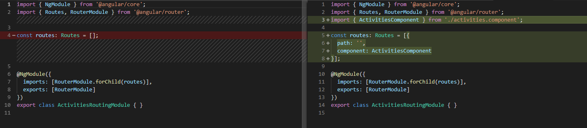
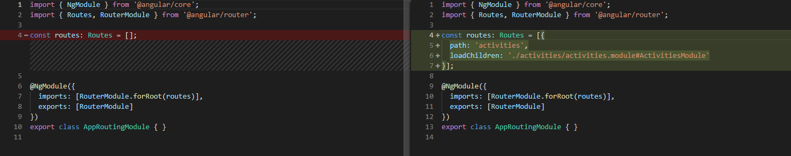

# Routing and Lazy Loading

[Live code](https://stackblitz.com/edit/s1-components-modules) to follow along from this section.

Routes allow you to have friendly names in the path URL that map to specific parts of the page rather than to completely different HTML pages.

Angular is a framework used to build a single page application \(SPA\), with the ability to dynamically load different parts of the application only when requested. This is called lazy loading.

Lazy loading is a technique used in Angular to download modules only when a specific route is activated. This speeds up the time it takes to initially load your application.

## Angular CLI generate command

Now that we know how to create a component manually, we can use an Angular CLI command that simplifies this process

Run the following commands in the command line \(CTRL + C for stop the serve\)

```bash
ng generate module activities --routing
```

The following creates activities.component.css, activities.component.css and activities.component.css in the app/activities folder as well as modifies the app.module.ts.

```bash
ng generate component activities --skipTests
```

.**..\daily-planner\src\app\activities\activities-routing.module.ts** add the following code.

```typescript
import { NgModule } from '@angular/core';
import { Routes, RouterModule } from '@angular/router';
import { ActivitiesComponent } from './activities.component';

const routes: Routes = [{
  path: '',
  component: ActivitiesComponent
}];

@NgModule({
  imports: [RouterModule.forChild(routes)],
  exports: [RouterModule]
})
export class ActivitiesRoutingModule { }
```


Here we insert the object with an empty path and specify we want to use ActivitiesComponent


In the app-routing.module.ts file, update the constant routes with the object as follows.

**...\daily-planner\src\app\app-routing.module.ts**

```typescript
import { NgModule } from '@angular/core';
import { Routes, RouterModule } from '@angular/router';

const routes: Routes = [{
  path: 'activities',
  loadChildren: './activities/activities.module#ActivitiesModule'
}];

@NgModule({
  imports: [RouterModule.forRoot(routes)],
  exports: [RouterModule]
})
export class AppRoutingModule { }
```

As you can see above, Angular routes accepts an array so you can specify as many routes as needed


when working with routing always restart `ng serve`


## Expected outcome


## Code changed

Changes in **activities-routing.module.ts**



**Figure: Final activities-routing.module.ts code**

Changes in **app-routing.module.ts** 



**Figure: Final app-routing.module.ts code**

Completed [live code](https://stackblitz.com/edit/s2-routing-lazy-loading) from this section.

