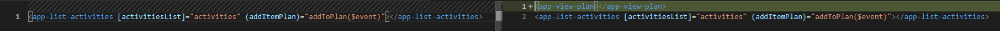
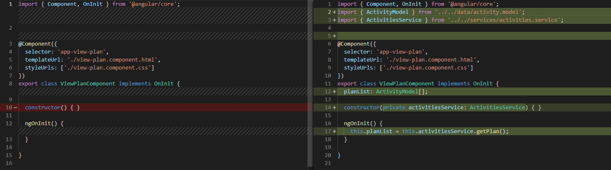
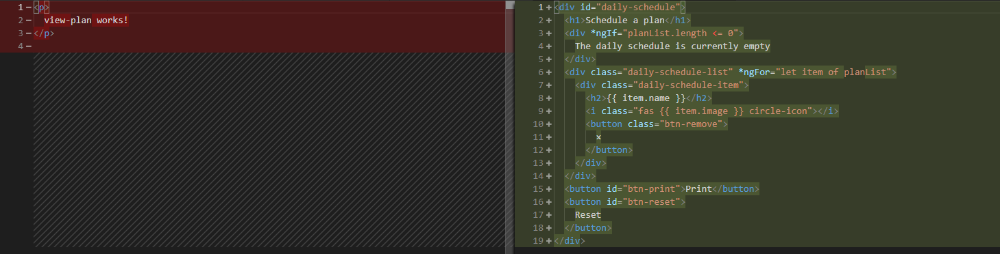
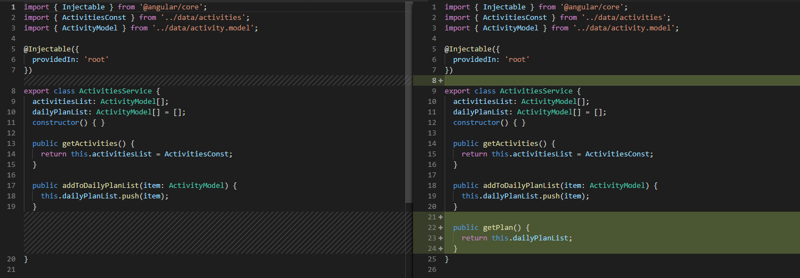

# View Plan Component and Add to Plan

[Live code](https://stackblitz.com/edit/s5-inputs-outputs-eventemitter) to follow along from this section.

Lets create a view-plan component

```bash
ng g c activities/view-plan --skipTests
```

In the activities.service.ts file create a new public method getPlan\(\) which returns our list of activities.

**...\daily-planner\src\app\services\activities.service.ts**

```typescript
public getPlan() {
  return this.dailyPlanList;
}
```

Inject the activities service into the view-plan.component.ts by adding it to the constructor

**...\daily-planner\src\app\activities\view-plan\view-plan.component.ts**

Declare a variable planList of type ActivityModel array inside the opening brackets of the export class and in ngOnInit\(\) call the function getPlan\(\) and assign it to planList variable.

```typescript
import { Component, OnInit } from '@angular/core';
import { ActivityModel } from '../../data/activity.model';
import { ActivitiesService } from '../../services/activities.service';


@Component({
  selector: 'app-view-plan',
  templateUrl: './view-plan.component.html',
  styleUrls: ['./view-plan.component.css']
})
export class ViewPlanComponent implements OnInit {
  planList: ActivityModel[];

  constructor(private activitiesService: ActivitiesService) { }

  ngOnInit() {
    this.planList = this.activitiesService.getPlan();
  }

}
```

In the view-plan.component.html file add

**...\daily-planner\src\app\activities\view-plan\view-plan.component.html**

```markup
<div id="daily-schedule">
  <h1>Schedule a plan</h1>
  <div *ngIf="planList.length <= 0">
    The daily schedule is currently empty
  </div>
  <div class="daily-schedule-list" *ngFor="let item of planList">
    <div class="daily-schedule-item">
      <h2>{{ item.name }}</h2>
      <i class="fas {{ item.image }} circle-icon"></i>
      <button class="btn-remove">
        ×
      </button>
    </div>
  </div>
    <button id="btn-print">Print</button>
  <button id="btn-reset">
    Reset
  </button>
</div>
```

Add the app-view-plan selector to the activities.component.html above the existing code

**...\daily-planner\src\app\activities\activities.component.html**

```markup
<app-view-plan></app-view-plan>
<app-list-activities [activitiesList]="activities" (addItemPlan)="addToPlan($event)"></app-list-activities>
```

## Code Changed

Changes in **activities.component.html** 



Changes in **view-plan.component.ts**



Changes in **view-plan.component.html** 



Changes in **activities-service.ts**



Completed [live code](https://stackblitz.com/edit/s6-view-plan-component) for this section.

