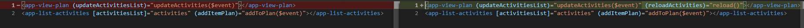
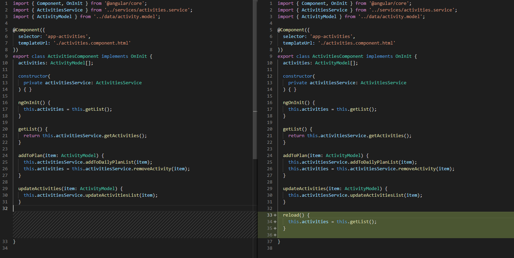
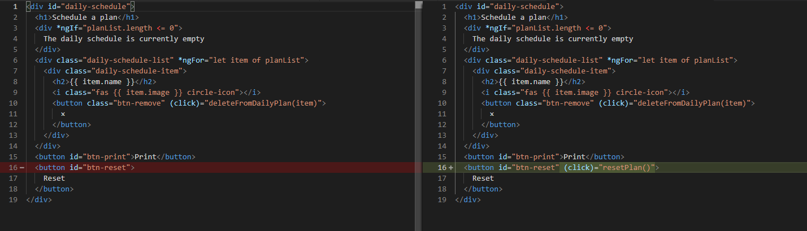
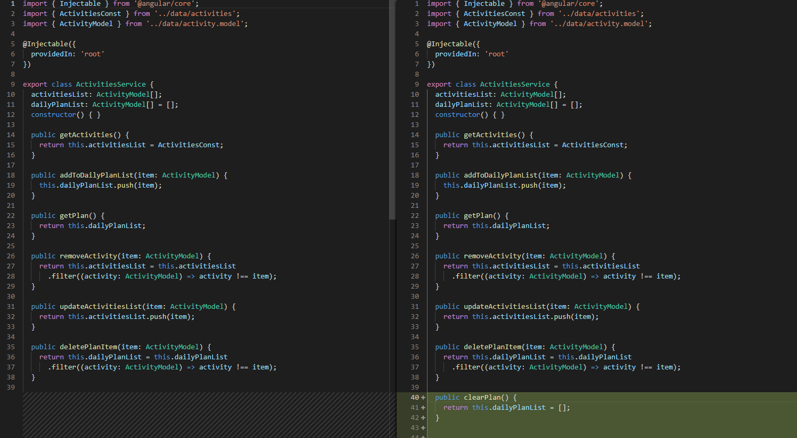

# Reset Daily Plan and Activities List

[Live code](https://stackblitz.com/edit/s6a-update-list-remove-button) to follow along from this section.

In this section, we will emit a message to the parent to clear/reset the daily schedule list

Add \(click\)="resetPlan\(\)" to the reset button

**..\daily-planner\src\app\activities\view-plan\view-plan.component.html**

```markup
<button id="btn-reset" (click)="resetPlan()">
    Reset
</button>
```

Then add EventEmitter and Output to the @angular/core import statement

**..\daily-planner\src\app\activities\view-plan\view-plan.component.ts**

In the view-plan.component.ts file create an @Output property for the reload message

```typescript
@Output() reloadActivities: EventEmitter<boolean> = new EventEmitter<boolean>();
```

Add this.reloadActivities.emit\(true\); to the resetPlan method

```typescript
resetPlan() {
    this.planList = this.activitiesService.clearPlan();
    this.reloadActivities.emit(true);
}
```

Add new method called clearPlan\(\) to the service

**..\daily-planner\src\app\services\activities.service.ts**

```typescript
public clearPlan() {
    return this.dailyPlanList = [];
}
```

Add output parameters to the app-view-plan selector in the activities.component.html

**..\daily-planner\src\app\activities\activities.component.html**

```markup
<app-view-plan (updateActivitiesList)="updateActivities($event)" (reloadActivities)="reload()"></app-view-plan>
```

In the activities.component.ts, create a reload function and call getList\(\)

**..\daily-planner\src\app\activities\activities.component.ts**

```typescript
reload() {
    this.activities = this.getList();
}
```

## Code Changed

Changes in **activities.component.html** 



Changes in **activities.component.ts** 



Changes in **view-plan.component.ts**


Changes in **view-plan.component.html**



Changes in **activities-service.ts** 



Completed [live code](https://stackblitz.com/edit/s6b-reset-plan-update-activities-list) for this section.

