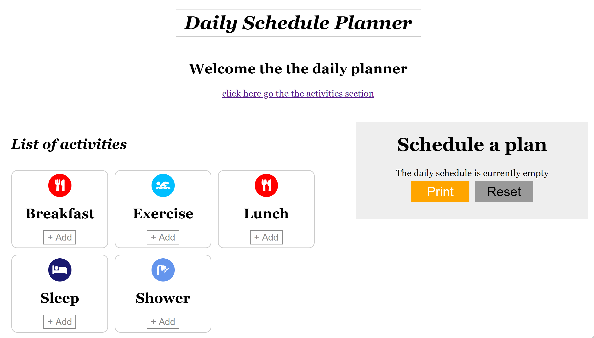
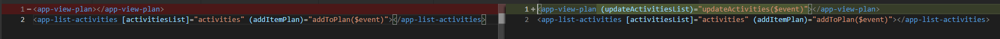
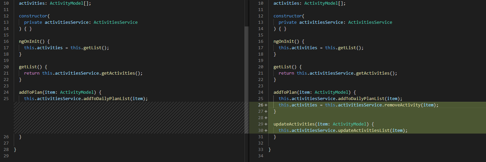
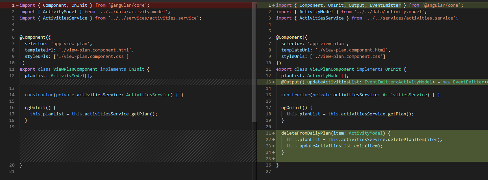
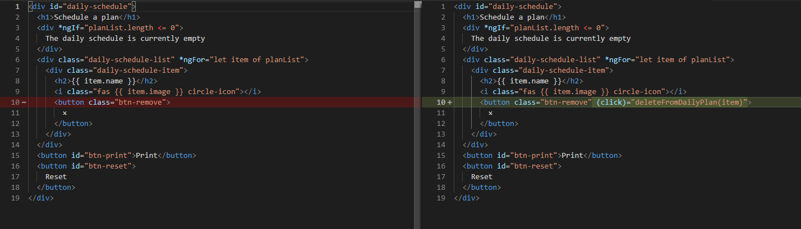
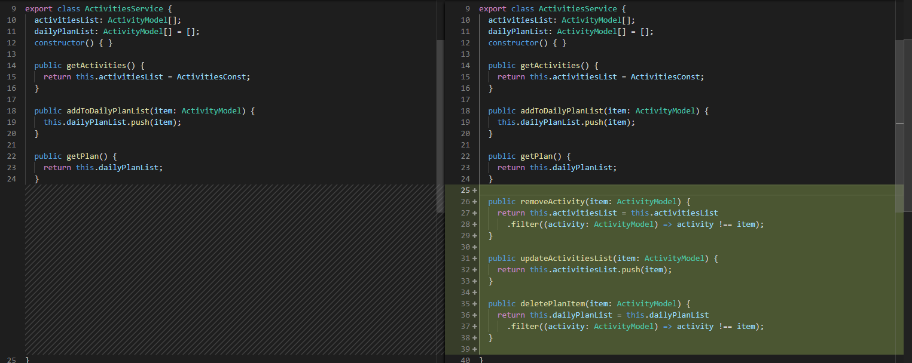

# Update View Plan

[Live code](https://stackblitz.com/edit/s6-view-plan-component) to follow along from this section.

After adding the activity to the dailyPlanList, we need logic to remove it from the activitiesList and if it's removed for the dailyPlanList, add it back to the activitiesList.

Create a removeActivities\(\), updateActivitiesList\(\) and delelePlanItem\(\) function

**..\daily-planner\src\app\services\activities.service.ts**

```typescript
public removeActivity(item: ActivityModel) {
    return this.activitiesList = this.activitiesList
      .filter((activity: ActivityModel) => activity !== item);
}

public updateActivitiesList(item: ActivityModel) {
    return this.activitiesList.push(item);
}

public deletePlanItem(item: ActivityModel) {
    return this.dailyPlanList = this.dailyPlanList
      .filter((activity: ActivityModel) => activity !== item);
}
```

Add a click event to call the method deleteFromDailyPlan\(\) and passing it the item that the use clicks to the delete button

**..\daily-planner\src\app\activities\view-plan\view-plan.component.html**

```markup
<button class="btn-remove" (click)="deleteFromDailyPlan(item)">
     ×
</button>
```

**..\daily-planner\src\app\activities\view-plan\view-plan.component.ts**

```typescript
import { Component, OnInit, Output, EventEmitter } from '@angular/core';
```

```typescript
 @Output() updateActivitiesList: EventEmitter<ActivityModel> = new EventEmitter<ActivityModel>();
```

```typescript
deleteFromDailyPlan(item: ActivityModel) {
    this.planList = this.activitiesService.deletePlanItem(item);
    this.updateActivitiesList.emit(item);
}
```

**..\daily-planner\src\app\activities\activities\activities.component.html**

```markup
<app-view-plan (updateActivitiesList)="updateActivities($event)"></app-view-plan>
```

In the activities.component.ts page set the dailyPlanList by calling addToDailyPlanList function in the service and reassign activities with the list returned for the removeActivities\(\) method in the service

**..\daily-planner\src\app\activities\activities.component.ts**

```typescript
addToPlan(item: ActivityModel) {
    this.activitiesService.addToDailyPlanList(item);
    this.activities = this.activitiesService.removeActivity(item);
}

updateActivities(item: ActivityModel) {
   this.activitiesService.updateActivitiesList(item);
}
```

## Expected Outcome



## Code Changed

Changes in **activities.component.html**



Changes in **activities.component.ts**



Changes in **view-plan.component.ts** 



Changes in **view-plan.component.html**



Changes in **activities-service.ts** 



Completed [live code](https://stackblitz.com/edit/s6a-update-list-remove-button) for this section.

