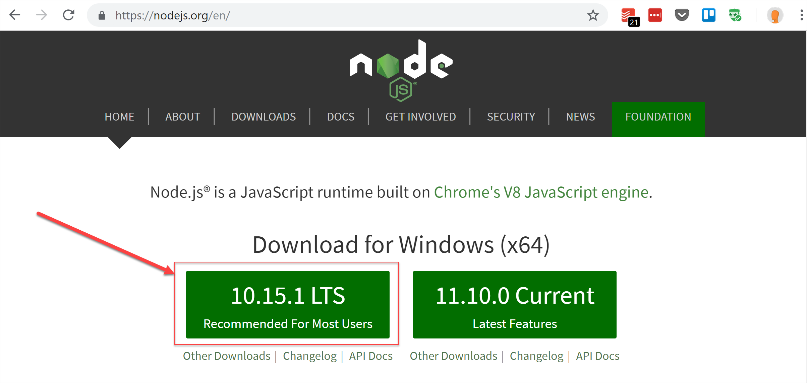
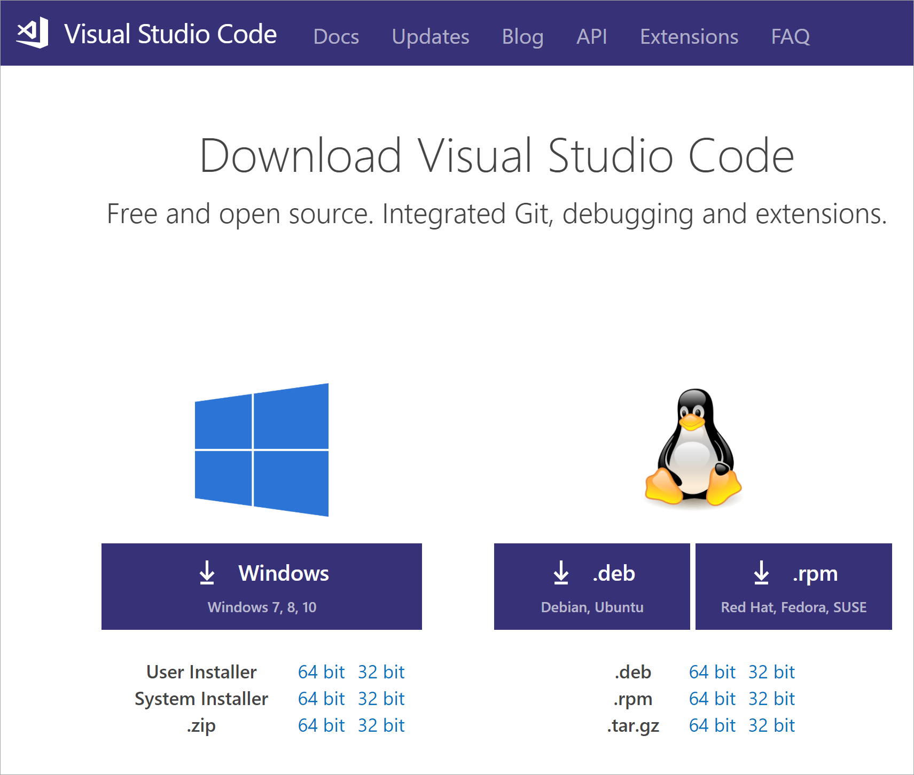
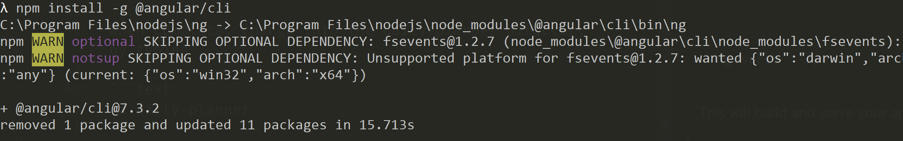
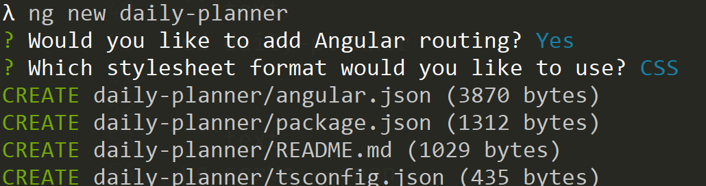
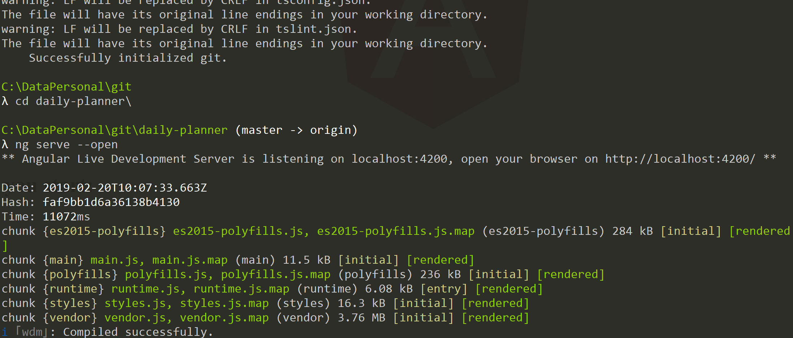
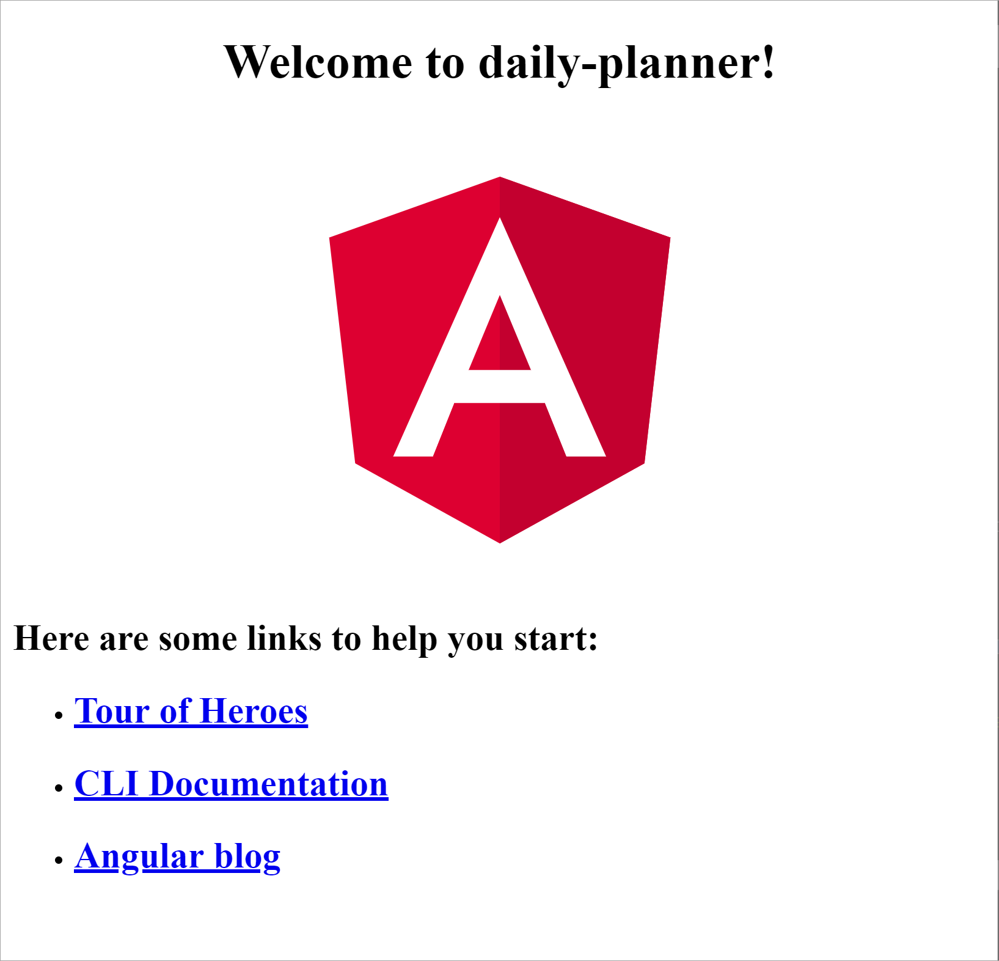
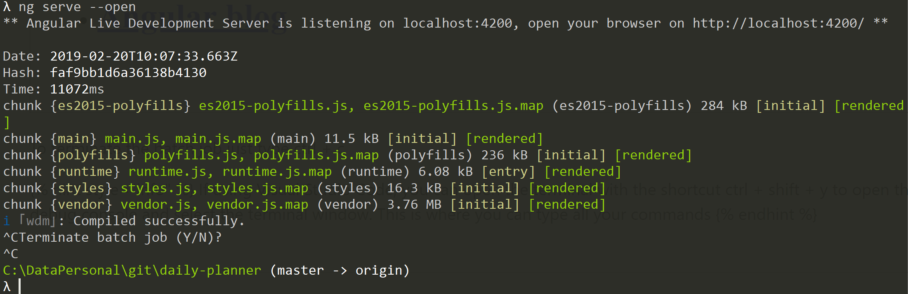
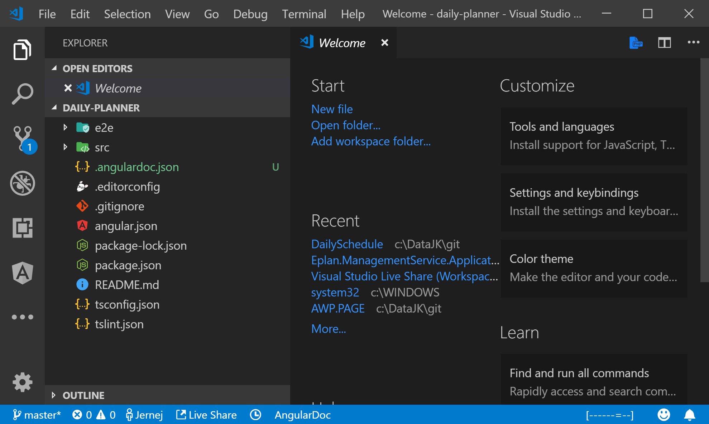
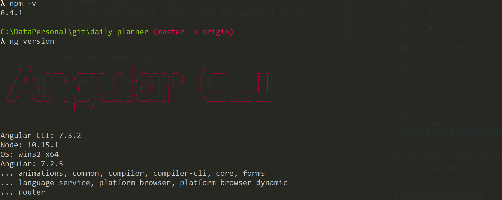

# Setup and Angular CLI

## NodeJS

Visit node.js [https://nodejs.org/en/](https://nodejs.org/en/) and download the recommended LTS \(Long-Term Support\) version



## Optional step - Download Visual Studio Code

> Visual Studio Code is a lightweight but powerful source code editor which runs on your desktop and is available for Windows, macOS and Linux. It comes with built-in support for JavaScript, TypeScript and Node.js and has a rich ecosystem of extensions for other languages \(such as C++, C\#, Java, Python, PHP, Go\) and runtimes \(such as .NET and Unity\). Install visual studio code for your platform from [https://code.visualstudio.com/download](https://code.visualstudio.com/download)



## Angular CLI \(Command Line Interface\)

> The Angular CLI helps to easily create and build Angular applications that work right out of the box and adhere to industry standards. To learn more, visit the official Angular CLI website [https://cli.angular.io/](https://cli.angular.io/)

Open up terminal on a Mac or command on Windows and change to your working directory.

### Install

Type the following into the terminal

```bash
npm install -g @angular/cli
```




`npm install` is used to install various packages for your Angular development. The `-g` means that the should be globally available, rather installed into the application.


### Verify

To verify installation of Angular CLI, do the following in the terminal

```bash
ng new daily-planner
```




While generating the project with ng new, answer yes to routing and choose css as the style sheet. This process may take a few minutes to complete.


When complete, change into the daily-planner directory by typing

```bash
cd daily-planner
ng serve --open
```



This will build and serve your application then open the url in the default browser.


Congratulations you have just made your first angular application with the default Angular template!




To terminate the batch job just type ctrl + c




If using Visual Studio Code, you can open the terminal with the shortcut ctrl + shift + y to open the debug console and select the terminal window. This is where you can type all your commands


When we open the project in our favourite IDE, we should see something like this




You can open Visual Studio Code in terminal window by typing `code .`.


## Troubleshooting

If you have issues, use `npm -v` and `ng version` to verify you have the right tools and right versions installed. Sometimes reinstalling NodeJS or AngularCLI helps.




For those who what to code along, click here for the [Live code](https://stackblitz.com/github/fiotrann/daily-planner/tree/initial-commit)


